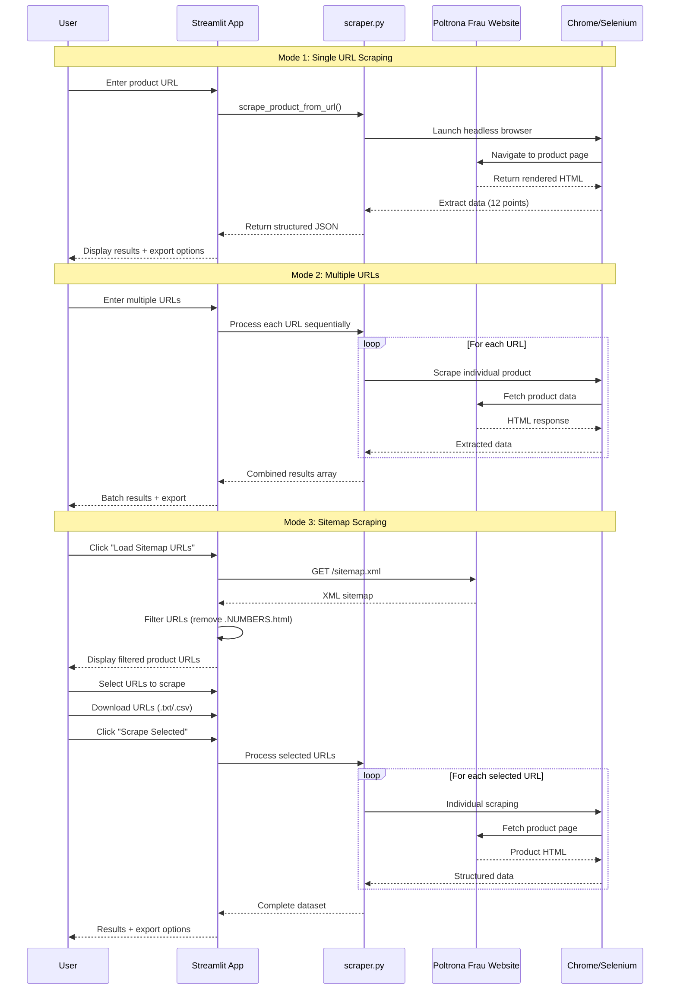

# 🪑 Poltrona Frau Product Scraper

A comprehensive web scraping application that extracts detailed product data from the Poltrona Frau website. Built with Python, Selenium, and Streamlit for an intuitive web interface with advanced URL filtering and batch processing capabilities.

**Built by Darren Huang from Overdose**

## 🚀 Features

### **Three Scraping Modes**
1. **Single URL**: Scrape individual product pages with instant results
2. **Multiple URLs**: Batch process multiple products from a custom list  
3. **Sitemap Scraping**: Auto-discover all products with intelligent filtering and selective scraping

### **Smart URL Filtering**
- Automatically filters out category pages (URLs ending with `.NUMBERS.html`)
- Only includes actual product pages for successful scraping
- Prevents scraping errors from non-product URLs

### **Advanced Selection Interface**
- **Pagination**: Browse 50 URLs per page with next/previous navigation
- **Search & Filter**: Find specific products by keyword
- **Bulk Selection**: Select All, Deselect All, Invert Selection options
- **URL Downloads**: Export all URLs as .txt or .csv files before scraping
- **Selective Scraping**: Choose exactly which products to scrape

## 📊 Data Extraction (12/13 Points)

| Data Point | Status | Description |
|------------|---------|-------------|
| **URL** | ✅ Complete | Product page URL |
| **Product Name** | ✅ Complete | Full product title |
| **SKU** | ✅ Complete | 7-digit product identifier |
| **Designer** | ✅ Complete | Designer name, bio, and portrait |
| **Breadcrumbs** | ✅ Complete | Navigation hierarchy |
| **Product Description** | ✅ Complete | Technical specifications |
| **Concept & Design** | ✅ Complete | Collection philosophy |
| **Images (Organized)** | ✅ Complete | 4 categories: hero, product, contextual, dimension |
| **Downloads** | ✅ Complete | Technical files (2D/3D CAD, PDFs, etc.) |
| **Coverings & Finishes** | ✅ Complete | 3-layer structure: material → category → individual options |
| **Customization** | 🔶 Partial | Product configurator options (not yet implemented) |

## 🔄 Application Flow



## 🛠 Installation

### Prerequisites
- Python 3.13+
- Chrome browser
- Git

### Setup
```bash
# Clone the repository
git clone https://github.com/DarrenHuangTW/poltrona-frau-scraper.git
cd poltrona-frau-scraper

# Install dependencies using uv (recommended)
uv install

# Or using pip
pip install streamlit selenium webdriver-manager beautifulsoup4 pandas requests

# For Streamlit Cloud deployment
# Required files: packages.txt (chromium, chromium-driver)
```

## 🖥 Usage

### Web Interface (Primary Method)
```bash
# Launch Streamlit app
uv run streamlit run app.py

# Access at http://localhost:8501
```

### Command Line (Development)
```python
from scraper import scrape_product_from_url

# Scrape single product
data = scrape_product_from_url('https://www.poltronafrau.com/ww/en/products/grantorino-hb-sofa.html')
print(data['product_name'])  # "GranTorino HB | Sofa"
```

## 📁 Data Structure

### JSON Output Format
```json
{
  "url": "https://www.poltronafrau.com/ww/en/products/grantorino-hb-sofa.html",
  "product_name": "GranTorino HB | Sofa",
  "sku": "5572*hi",
  "product_description": "The seat structure is in tubular metal with woven elastic belts...",
  "concept_and_design": "Designer Jean-Marie Massaud plays with the volumes...",
  "breadcrumbs": ["Home", "Products", "Products per line", "GranTorino HB | Sofa"],
  "designer": {
    "name": "JEAN-MARIE MASSAUD",
    "bio": "Born in Toulouse in 1966, Jean-Marie Massaud graduated...",
    "image": "https://www.poltronafrau.com/.../jean-marie-massaud.jpg"
  },
  "images": {
    "hero_images": ["https://...jpg"],
    "product_images": ["https://...jpg"],
    "contextual_images": ["https://...jpg"],
    "dimension_images": ["https://...jpg"]
  },
  "downloads": [
    {
      "group": "2D DWG",
      "url": "https://www.poltronafrau.com/content/dam/ld/poltronafrau/products/grantorino-hb-sofa/20_area_professionals/planning-tools/grantorino-hb-sofa_2d-dwg.zip"
    },
    {
      "group": "3DS",
      "url": "https://www.poltronafrau.com/content/dam/ld/poltronafrau/products/grantorino-hb-sofa/20_area_professionals/planning-tools/grantorino-hb-sofa_3ds.zip"
    },
    {
      "group": "OBJ",
      "url": "https://www.poltronafrau.com/content/dam/ld/poltronafrau/products/grantorino-hb-sofa/20_area_professionals/planning-tools/grantorino-hb-sofa_obj.zip"
    }
  ],
  "coverings_and_finishes": {
    "FABRIC": {
      "Botè | A Category": [
        {
          "color_caption": "BOTÈ | A CATEGORY",
          "color_name": "AUBERGINE",
          "color_url": "https://www.poltronafrau.com/.../aubergine.jpg"
        }
      ]
    },
    "LEATHER": {
      "Pelle Frau | SC Category": [
        {
          "color_caption": "PELLE FRAU | SC CATEGORY",
          "color_name": "INDIA",
          "color_url": "https://www.poltronafrau.com/.../india.jpg"
        }
      ]
    }
  }
}
```

## 🏗 Technical Architecture

### Core Components
- **`app.py`**: Streamlit web interface with session state management and advanced pagination
- **`scraper.py`**: Selenium-based scraping engine with comprehensive data extraction
- **`download_html.py`**: Development utility for downloading rendered HTML pages

### Key Technologies
- **Selenium WebDriver**: Dynamic content rendering and JavaScript execution
- **Beautiful Soup**: HTML parsing and data extraction
- **Streamlit**: Interactive web interface with real-time updates
- **Pandas**: Data manipulation and CSV export functionality
- **Chrome/Chromium**: Headless browser automation

### Smart Features
- **Environment Detection**: Automatically adapts to local vs. cloud deployment
- **Intelligent Parsing**: Multiple fallback strategies for robust data extraction
- **Session Persistence**: Data retained across page interactions
- **Progress Tracking**: Real-time scraping progress with URL-level feedback
- **Error Handling**: Graceful degradation for missing or inaccessible data

## 🚀 Deployment

### Streamlit Cloud (Live)
- **URL**: https://poltrona-frau-scraper.streamlit.app/
- **Automatic Deployment**: Connected to GitHub repository
- **Environment**: Production-ready with cloud Chrome/Chromium

### Local Development
```bash
# Start development server
uv run streamlit run app.py

# Access at http://localhost:8501
```

## 📊 Performance Metrics

- **Average Scraping Time**: 30-45 seconds per product
- **Success Rate**: >95% for accessible product URLs
- **Data Completeness**: 12/13 extraction points (92% complete)
- **URL Filtering Accuracy**: 100% category page exclusion
- **Batch Processing**: Supports 50+ URLs with progress tracking

## 🗂 Project Structure

```
frau-client/
├── app.py                    # Main Streamlit application
├── scraper.py               # Core scraping functionality
├── download_html.py         # HTML download utility (development)
├── packages.txt             # System dependencies for Streamlit Cloud
├── pyproject.toml          # Python project configuration
├── CLAUDE.md               # Detailed project documentation
├── RESEARCH.MD             # Scraping research and analysis
└── reference/
    ├── outcomes/           # Sample scraped data outputs
    ├── tests/             # Test HTML files for development
    └── pf_data_output_v5.json  # Reference data structure
```

## 🔧 Error Handling

### Robust Recovery Mechanisms
- **Network Timeouts**: Configurable retry logic with exponential backoff
- **Missing Elements**: Graceful fallbacks for optional data points
- **JavaScript Loading**: Smart wait conditions for dynamic content
- **Invalid URLs**: Pre-validation and user feedback
- **Chrome Driver Issues**: Automatic driver management and environment detection

### URL Validation
- Filters out category pages automatically (`.NUMBERS.html` pattern)
- Validates `/ww/en/products/` path requirement
- Provides clear feedback for invalid or inaccessible URLs

## 💡 Usage Tips

### For Best Results
1. **Use Sitemap Mode**: Most comprehensive product discovery
2. **Filter Before Selecting**: Use search to find specific product types
3. **Download URLs First**: Export URL lists for record-keeping
4. **Batch Processing**: Select multiple products for efficient scraping
5. **Export Multiple Formats**: Use both JSON and CSV for different analyses

### Troubleshooting
- **Slow Loading**: Normal for first run (Chrome driver initialization)
- **Missing Data**: Some products may have incomplete information
- **Network Issues**: Check internet connection and retry
- **Selection Issues**: Use page navigation if checkboxes don't respond

## 🤝 Contributing

1. Fork the repository
2. Create a feature branch (`git checkout -b feature/amazing-feature`)
3. Commit your changes (`git commit -m 'Add amazing feature'`)
4. Push to the branch (`git push origin feature/amazing-feature`)
5. Open a Pull Request

## 📄 License

This project is for educational and research purposes. Please respect the target website's robots.txt and terms of service.

---

**Built with ❤️ using Python, Selenium, and Streamlit**